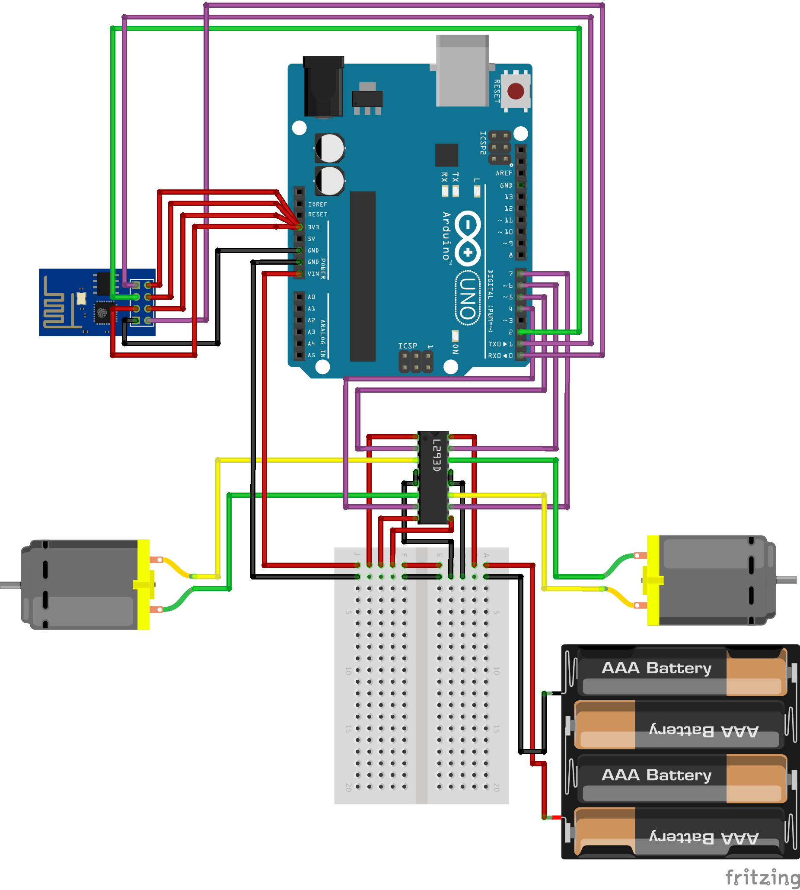

# Project Alpheus
An Arduino-based, Python powered robot that uses a remote camera to calculate its position and draw arbitrary objects on a drawing surface

Terminology:
* James: the drawing robot
* Deus: the camera that looks from above and allows James to control its position

## Control Structure
A mobile phone camera (Deus) will provide the live image data of the robot. Deus will need to be directly above the drawing surface, however this requirement will hopefully not be required in future iterations.

Deus will also provide the live image data to the processing unit (which will either be the Deus itself or a Raspberry Pi). The processing unit will perform all calculations required to get the required speeds for the left and right wheel.

The processing unit will then send the commands to the James, through an ESP8622 ESP-01 WiFi component. 

James is will move around on the horizontal surface. The on-board Arduino, having received the commands, will execute them and thereby either change it's position or put the pen on the drawing surface.

After the commands are executed, the cycle will start again, with Deus sending commands to James so that James tracks the correct path in real space.

## Circuit diagram

